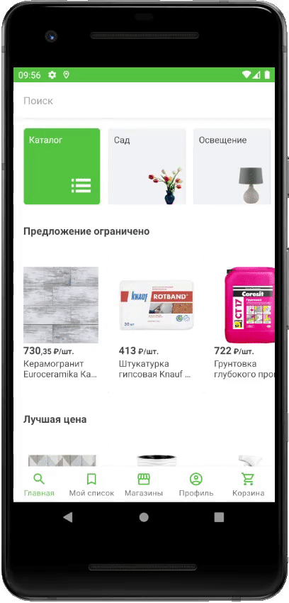

# LeroyMerlinMainUiTest

Данный проект был создан в качестве задания для отклика на вакансию Стажер (Android разработчик) в Леруа Мерлен. В него входит вёрстка главного экрана приложения Leroy Merlin.
Что использовалось в проекте:
Язык - Kotlin: 
1) Архитектурный паттерн - MVVM; 
2) Внедрение зависимостей - Dagger2;
3) Локальное хранение данных - Room;
4) Работа с изображениями - Picasso;
5) Работа с fake API - RXJava3.
